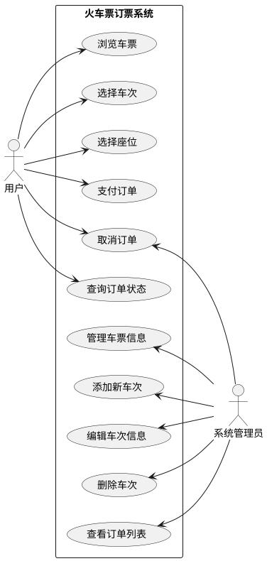
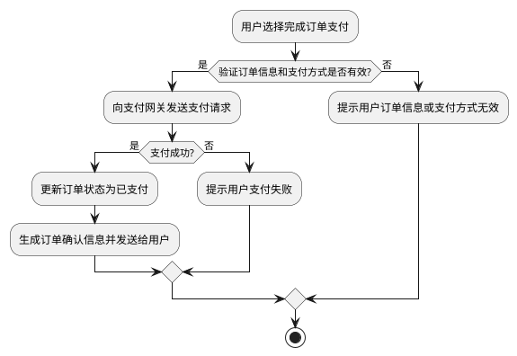
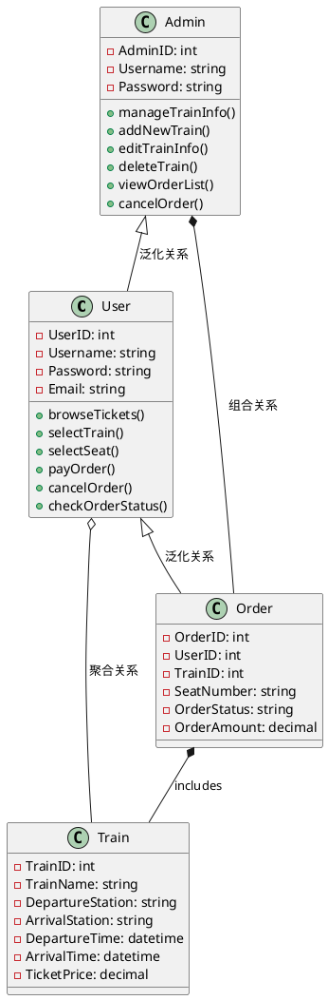
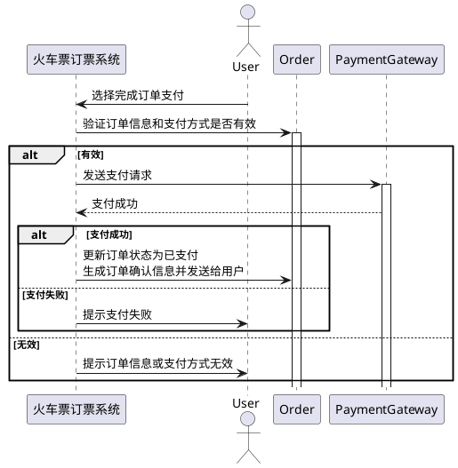

# Tool：Chat-gpt 3.5

# Q1





# Q2





# Q3

**我**：请继续，对于“火车票订票系统”中存储的数据，以及数据关系，帮我分析并改进该数据库设计，生成对应的数据库建表语句。

**Chat-gpt:**

好的，对于火车票订票系统，可以考虑以下数据存储和关系：

1. 用户信息：包括用户ID、用户名、密码、邮箱等。
2. 车次信息：包括车次ID、车次名称、出发站、到达站、出发时间、到达时间、票价等。
3. 订单信息：包括订单ID、用户ID、车次ID、座位号、订单状态、订单金额等。

基于以上分析，我们可以改进数据库设计并生成对应的建表语句。以下是一个简化的数据库设计及其对应的建表语句：

```sql
-- 用户信息表
CREATE TABLE Users (
    UserID INT PRIMARY KEY AUTO_INCREMENT,
    Username VARCHAR(50) NOT NULL,
    Password VARCHAR(50) NOT NULL,
    Email VARCHAR(100) NOT NULL
);

-- 车次信息表
CREATE TABLE Trains (
    TrainID INT PRIMARY KEY AUTO_INCREMENT,
    TrainName VARCHAR(100) NOT NULL,
    DepartureStation VARCHAR(100) NOT NULL,
    ArrivalStation VARCHAR(100) NOT NULL,
    DepartureTime DATETIME NOT NULL,
    ArrivalTime DATETIME NOT NULL,
    TicketPrice DECIMAL(10, 2) NOT NULL
);

-- 订单信息表
CREATE TABLE Orders (
    OrderID INT PRIMARY KEY AUTO_INCREMENT,
    UserID INT NOT NULL,
    TrainID INT NOT NULL,
    SeatNumber VARCHAR(20) NOT NULL,
    OrderStatus VARCHAR(20) NOT NULL,
    OrderAmount DECIMAL(10, 2) NOT NULL,
    FOREIGN KEY (UserID) REFERENCES Users(UserID),
    FOREIGN KEY (TrainID) REFERENCES Trains(TrainID)
);
```

这些表包括了用户信息、车次信息和订单信息，并通过外键建立了它们之间的关系。此设计可以帮助管理系统中的数据，并确保数据的一致性和完整性。

# Q4

**我**：请继续，帮我继续生成“火车票订票系统”的类架构图，并生成相应的绘图代码，请一定要指明个各类之间的关系，生成系统架构图。类要包括用户，管理员，车次，订单

**Chat-gpt**:

好的，下面是火车票订票系统的简化类架构图及其对应的PlantUML绘图代码：



这个系统架构图展示了火车票订票系统中的四个主要类：用户(User)、管理员(Admin)、车次(Train)和订单(Order)。类之间的关系包括用户和订单之间的下订单关系，管理员和订单之间的订单管理关系，用户和车次之间的选择车次关系，以及车次和订单之间的订单包含关系。

**我**：帮我说明个各类之间的关系是一下三种关系的哪一种：泛化关系，组合关系，聚合关系

**Chat-gpt**:让我们逐个分析各个类之间的关系，以确定它们是泛化关系、组合关系还是聚合关系：

1. 用户(User)和订单(Order)之间的关系是“下订单”，这是一个泛化关系，因为用户通过订单类创建订单，订单是用户的一种特殊情况。
2. 管理员(Admin)和订单(Order)之间的关系是“管理订单”，这是一个组合关系，因为管理员可以创建、修改和删除订单，订单的生命周期由管理员类管理。
3. 用户(User)和车次(Train)之间的关系是“选择车次”，这是一个聚合关系，因为用户可以选择多个车次，而车次并不依赖于任何特定的用户。

4. 订单(Order)和车次(Train)之间的关系是“订单包含车次”，这是一个组合关系，因为订单中包含了车次的信息，而订单的生命周期与车次的生命周期是紧密相关的，订单的存在依赖于车次。
5. 管理员(Admin)和用户(User)之间的关系是“用户管理”，这是一个泛化关系，因为管理员拥有对用户的管理权限，用户可以通过管理员进行身份验证、密码重置等操作，因此管理员是用户的一种特殊情况。

所述，订单和车次之间的关系是组合关系，管理员和用户之间的关系是泛化关系。


# Q5

**我**：结合上述类架构图，生成实现“订单支付”相关用例的实现序列图的plantuml的代码，尽可能的详细

**Chat-gpt**：

好的，下面是实现“订单支付”相关用例的序列图的PlantUML代码，结合了上述类架构图中的类：



这个序列图描述了用户进行订单支付时系统的处理流程，包括了用户与系统的交互以及系统内部订单类和支付网关的交互。


# Thinking:

AIGC（人工智能生成代码）工具在软件开发中可以发挥重要作用，特别是在加快开发速度、提高生产效率和减少人为错误方面。以下是我对利用AIGC工具进行软件开发的思考和想法：

1. **自动生成代码框架：** 开发人员可以使用AIGC工具来自动生成软件项目的代码框架。这包括生成基本的文件和目录结构、类和方法的模板，从而加速项目的初始化过程。

2. **自动生成重复性代码：** 在软件开发过程中，存在大量的重复性代码，如数据验证、错误处理等。利用AIGC工具可以自动生成这些重复性代码，节省开发时间和减少错误。

3. **自动生成单元测试：** AIGC工具可以自动生成单元测试代码，帮助开发人员快速创建和维护单元测试套件。这有助于提高软件质量和稳定性。

4. **自动生成文档：** AIGC工具可以根据代码自动生成文档，包括API文档、用户手册等。这有助于提高代码的可读性和可维护性，同时减少编写文档的工作量。

5. **自动化代码审查：** AIGC工具可以用于自动化代码审查，帮助开发团队发现潜在的代码缺陷和风险。这有助于提高代码质量和降低维护成本。

6. **智能代码建议：** AIGC工具可以分析已有代码并提供智能建议，帮助开发人员优化代码结构和性能。

7. **自动生成模型和数据训练：** 在机器学习和数据科学领域，AIGC工具可以用于自动生成模型和训练数据，加速模型开发和部署过程。

