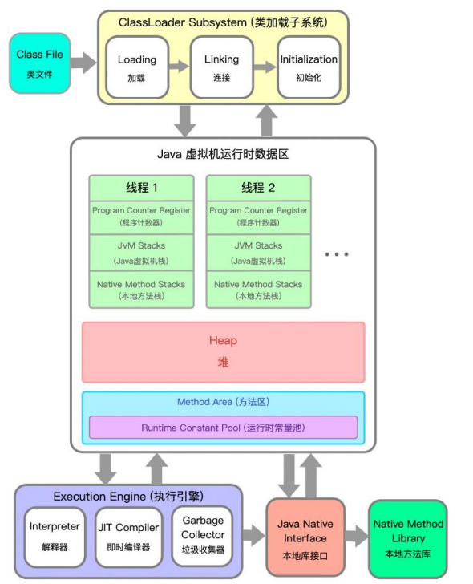
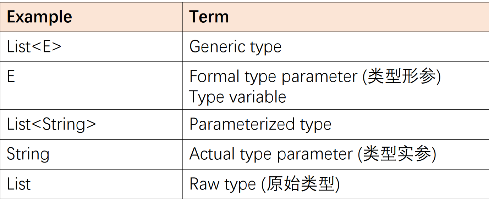
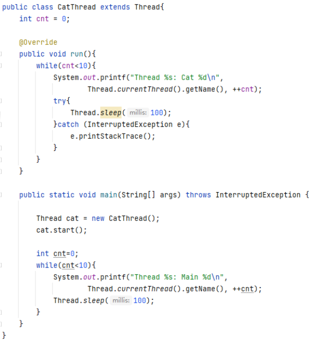
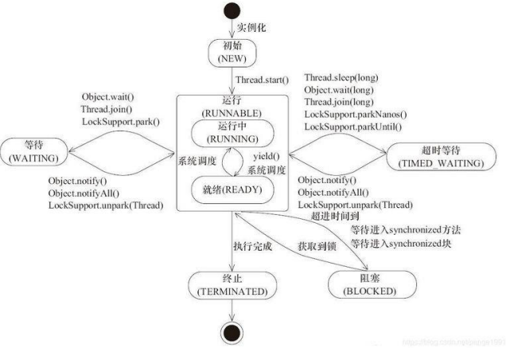
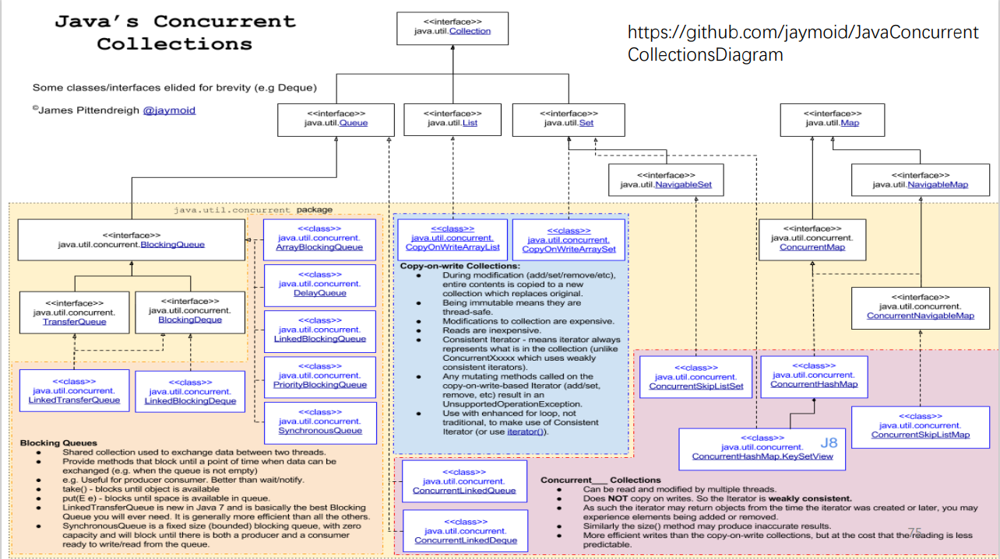
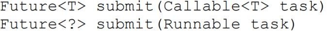
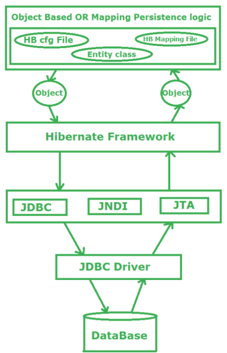

## L1



### OOP basic  concepts

#### Encapsulation

- Program should interact with object data only through the  object’s methods.
- Encapsulation is achieved by the **Access Control** mechanism in Java


#### Inheritance

- **boolean equals(Object obj)** Indicates whether another obj is "equal to" this one; return True  only if two variables refer to the same physical object in memory

- **String toString()** Returns a string representation of the object. Default is  the name of the class + “@” + hashCode

#### Abstraction

- Abstraction simplifying complex systems by **exposing only  the necessary details.**  
- Abstraction solves problem **at design level**  
- Achieved in Java by **interface and abstract class**

- A class can **implement multiple interfaces**, but can  **inherit only one abstract class** 
- *An abstract classe is used for creating a base class  with shared behavior* 
- *An interface is used for defining contracts that  multiple classes (may not be similar) can adhere to*

- **java.lang.Comparable Interface**   Contains **only one abstract method: int compareTo(T o)**

#### Polymorphism

- Compile time

**Static binding** (early binding) 

 Method overloading (methods with the  same name but different parameters) are  resolved using static binding

- Run time

**Dynamic binding** (late binding) 

Method overriding (subclass overrides a  method in the superclass) are resolved  using dynamic binding

### Software design principles

-  **High Cohesion (高内聚)** 

modules **are self-contained and have a single, well-defined purpose**; all of its  elements are directly related to the functionality that is meant to be provided by the module

-  **Low Coupling (低耦合)** 

modules should be **as independent as possible from other modules,** so that  changes to one module will have minimal impact on other modules

-  **Information Hiding (信息隐藏)**
  - Key idea: **Hiding certain information,**  such as design decisions, data, and  implementation details, from client  programs 
  - Advantages: Client programs won’t  have to change even if the core  design or implementation is changed

## L2

###  Generics

**Parameterized types**: types like classes and interfaces can  be used as parameters



#### Generic classes

**Classes in Java Collections (e.g., List,  Queue, Set) are typically generic classes**

#### Generic interfaces

#### Generic methods: Methods that introduce their own type parameters

Bounds for Type Variables：

<T extends BoundingType>

- T could be any subtype of the bounding type 
- Both T and bounding type can be either a class or an  interface 
- Multiple bounds are allowed, separated by & (a class must  be the first one in the bounds list)

#### Wildcards (通配符)

Use“?”to create a relationship between generic types 

- Pair is the parent of Pair, Pair, Pair, etc.

- Unbounded:  Pair is a superclass of Pair for any T 
-  Upper bounded:  Pair: a pair of any type that is a subtype of T  Bounded by the superclass 
- Lower bounded: Pair: a pair of any type that is a supertype of T  Bounded by the subclass

#### Type Erasure

- To be compatible with previous  versions, the implementation of  Java generics adopts the strategy  of pseudo generics 
- Java supports generics in syntax,  but the so -called “type erase”  will be carried out in the  compilation stage to replace all  generic representations with  specific types 
- To JVM, there is no generics at all


### Collections


#### Interface

#####  Iterable and Iterator

An Iterable class could be iterated over using an Iterator

```java
public static void removeNulls(Collection<?> c) {
	for (Iterator<?> i = c.iterator(); i.hasNext(); ) {
		if (i.next() == null){
			i.remove();
		}
    }
}
```

##### Set


**Two sets are equal if they have the same size, and  every member of one set is contained in the other set； The hash code of a set is defined to be the sum of the  hash codes of the elements in the set**

##### List

**List Iterator has new operations for the list data  structure like: add, hasPrevious, previous**

#### Implementations

##### List Implementation

- ArrayList: internally uses an array to  store the elements 
- LinkedList: internally uses a doubly  linked list to store the elements

##### Map implementation

###### HashMap


- hashCode() returns an integer value. By default, it converts the  internal address of the object into an integer 
- equals() checks if objects are equal. By default,  Object.equals(Object obj) { return (this == obj);} 
- If two objects are equal according to the equals(Object)  method, then calling the hashCode method on each of the two  objects must produce the same integer result (if you override  equals, you must override hashCode.).

###### Linked HashMap

Linked HashMap uses before  and after to preserve the  insertion order of the keys

###### TreeMap

Use TreeMap when keys  need to be ordered using  their natural ordering or  by a Comparator.

##### Set


##### Comparator

- The Comparable interface is used to compare objects using one of  their property as the default sorting order.  Provide compareTo(T o)  
- A comparable object can compare itself with another object 
- The Comparator interface is used to compare two objects of the same  class by different properties  Provide compare(T o1, T o2) 
-  Comparator is a separate class and external to the element type being compared

#### Algorithms

##### Sort

 **Collections.sort(list)  has compilation error if  list elements do not  implement Comparable**

## L3

### Functional Programming

Functional programming  is a **programming  paradigm (编程范式)**

##### No Side Effects

-  Side effects: Events that are caused by a system with a  limited scope, whose effects are felt outside of that scope 
-  Pure functions have no side effects (cannot change external  states)
- **Pure functions always produce the same output for the  same input (regardless of the history**

##### Immutability

- Variables, once defined, never change their values (eliminate  side effects) 
- Pure functional programs do not have assignment statements

##### Loops

- No “while” or “for” loop in functional programming
- How do we perform iterations though?
  - Using recursive functions (which  invoke themselves) Or higher order functions (e.g., map)

### Lambda Expressions

A Java lambda expression 

-  is an anonymous function with no name/identifier 
- can be created without belonging to any class 
- can be passed as a parameter to another function 
- are callable anywhere in the program

#### Syntax

##### (param1, param2) -> {expressions or statements}

Left part – **function parameters** 

- No function name 
- Parentheses could be omitted for a  single parameter  
- Multiple parameters are separated by  comma (,) 
-  () is used if no parameter is needed

Right part – **function body**

- Curly braces could be omitted for a single  expression
- Multiple statements are separated by a  semi-colon (;)
- Can have a return statement
- Local assignments and control structures  (if, for) are allowed (but probably less  common)

```java
(first, second) ->
{
	if (first.length() < second.length()) return -1;
	else if (first.length() > second.length()) return 1;
	else return 0;
}
```

##### Matching Lambdas to Functional Interfaces

**Lambda: a shortcut to define an implementation of a  functional interface**

Functional interface is an interface with a single abstract  method

- Matching lambda to interface 
  - By comparing caller method’s parameter type
- Matching lambda to interface’s abstract method
  - The interface must have only one abstract (unimplemented) method
- Matching method parameters and return type
  - Parameter types and return type must match

All of these must be satisfied to replace a functional interface with lambda successfully

**A functional interface must have only one abstract (unimplemented)  method, but it can have multiple default and static methods**

#### Method Reference

Method reference allows us  to refer to this one method  by name, which is often (but  not always) easier to read

- static method

- Instance method (Bound)

  - We call the InstanceName bounded receiver since the receiver  is bounded to the instance.

- Instance method (Unbound)

  - We call ClassName unbounded receiver  since the receiver instance is bounded later.

  - Unbound receivers allow us to use instance  methods as if they were static methods;  However, the creation of instances are still  required, but are deferred (decided later)

  - ```java
    Transformer transformer = (s) -> s.toLowerCase();
    
    Transformer transformer = String::toLowerCase;
    String res = transformer.transform("Hello Java");
    ```

- Constructor


#### Java Functional Interfaces

- Consumer
  - represents a function that takes an argument of type T and returns nothing  (consume it)
- Supplier
  - The Supplier interface has one abstract method T get()
  - represents a function that takes no argument and returns (supplies) a value of type T
- Predicate
  - The Predicate interface has one abstract method boolean test(T t)
  - represents a function that takes a value of type T and returns a boolean
- Function
  - The Function interface has one abstract method R apply(T t)
  - represents a function that takes a value of type T and returns a value of type R


The Operator interfaces represent  functions whose result and  argument types are the same

The Predicate interface represents  functions who take an argument and  return a boolean

The Function interface represents  functions whose result and  argument types could differ

## L4

### Java 8 Stream

#### Create a Stream

- getting a Stream from a Java Collection,  which has the stream() method

- using Stream.generate(), which needs a  Supplier as input

  - ```java
    Stream<String> echos = Stream.generate(() -> "Echo");
    Stream<Double> randoms = Stream.generate(Math::random);
    ```

- using Stream.iterate(), which creates a  stream of seed, f(seed), f(f(seed)), etc.
  - ```Stream evenNumber = Stream.iterate(2, n -> n + 2); evenNumber.limit(10).forEach(System.out::println);```

- using Stream.of(), which has a varargs parameter (take any number of arguments

#### Intermediate Operations


**[Lazy evaluation]** All intermediate operations  do not get executed until a terminal operation  is invoked (discussed later)

- **filter**
  - Returns a stream consisting of the elements of this stream  that match the given predicate
- **map**
  - Returns a stream consisting of the results of applying/mapping  the given function to the elements of this stream.
- **sorted**
  - sorted(): sort the elements by natural order 
  - sorted(Comparator comparator): sort the  elements according to the given Comparator

#### Terminal Operations

**[Eager execution]** Terminal operations are  early executed (discuss later)


- **Reduction**: A reduction is a terminal operation that aggregates a stream  into a type or a primitive

  - min() 
  - max() 
  - average() 
  - sum() 
  - reduce(): <- the general one
    - ```int sum = arrayList.stream().reduce((a,b)->a+b).orElse(0); ```
    - ```int sum = arrayList.stream().reduce(0, (a,b)->a+b);```
    - 

- **Collecting Results**

  - 

    - ```List result = stream.collect(Collectors.toList()) ```								

      ```Set result = stream.collect(Collectors.toSet()) ```								

      ```TreeSet result = stream.collect(Collectors.toCollection(TreeSet::new))```

    - ```java
      Stream<String> stream = Stream.of("a", "bb", "cc", "ddd");
      
      Map<String, Integer> map = stream.collect(Collectors.toMap(Function.identity(), String::length));
      //{bb=2, cc=2, a=1, ddd=3}
      
      String joined = stream.collect(Collectors.joining("$"));
      //a$bb$cc$ddd
      ```

    - ```java
      Stream<String> stream = Stream.of("a", "bb", "cc", "ddd", "a", "bb", "eee");
      Map<Integer, List<String>> group = stream.collect(Collectors.groupingBy(String::length));
      //{1=[a, a], 2=[bb, cc, bb], 3=[ddd, eee]}
      
      Stream<String> stream = Stream.of("a", "bb", "cc", "ddd", "a", "bb", "eee");
       Map<Integer, Set<String>> group = stream.collect(Collectors.groupingBy(String::length, Collectors.toSet()));
      //{1=[a], 2=[bb, cc], 3=[eee, ddd]}
      ```

    - ```java
      Stream<String> stream = Stream.of("a", "bb", "cc", "ddd", "a", "bb");
      Map<String, Long> group = stream.collect(Collectors.groupingBy(Function.identity(), Collectors.counting()));
      //{a=2, bb=2, cc=1, ddd=1}
      
      Stream<String> stream = Stream.of("1a", "1bb", "1c", "2a", "2a", "2bb");
      Map<Character, Set<String>> group = 
      stream.collect(Collectors.groupingBy(s->s.charAt(0), 
      Collectors.mapping(s->s.substring(1), Collectors.toSet())));
      //{1=[c, a, bb], 2=[bb, a]}
      ```

#### Lazy Evaluation

- **Intermediate operations  are lazily executed**
  - They only remember the  operations, but don’t do  anything right away (lazy)
- **Terminal operations are  eagerly executed**
  - When terminal operations  are initiated, the  remembered operations  are performed one by  one (eager)


#### findFirst()

Returns an Optional describing the first element of this  stream, or an empty Optional if the stream is empty

### Optional


## L5

###  I/O Overview

##### overview


**Character Stream is used to handle  Internationalization (i18n), where  character encoding makes software  systems international**

##### Encoding

Convert characters (字符) to other formats, often numbers,  in order to store and transmit  them more effectively

###### ASCII

- Represent text in computers 
- Using 7 bits to represent 128 characters 
- Extended ASCII uses 8 bits for 256 characters

###### GB2312, GBK, GB18030

- GB stands for 国标 
- GB2312 uses 2 bytes (cover 99% daily usages) 
- **GBK (国标扩展) extends GB2312** to encode more characters 
- **GB18030 extends GBK**

###### Unicode 

- Motivated by the need to encode characters in all languages  consistently without conflicts 
- A character maps to something called a **code point** (A: U+0041) 
- Unicode comprises 1,114,112 code points in the range 0hex to 10FFFFhex


-  Unicode legal range now: U+0000 to U+10FFFF 
- Characters whose code points are greater than U+FFFF  are called supplementary characters 
- Supplementary characters are represented as a pair of  char values (16 + 16 = 32 bits / 4 bytes)

### Byte Streams & Character Streams

#### Byte Stream

-  Input stream: an object from which we  can read a sequence of bytes 
- Output stream: an object to which we can  write a sequence of bytes 
- **Byte streams are inconvenient for  processing info stored in Unicode**

#### Character Stream

- A separate hierarchy provides classes,  inheriting from Reader and Writer, for  processing Unicode characters 
- These classes have read and write  operations that are based on char values  rather than byte values

#### Similarity

- InputStream & OutputStream,  Reader& Writer are abstract classes 
- Subclasses are all called “xxxStream”  or “xxxReader” & “xxxWriter” 
- Subclasses for InputStream or  Reader must implement read() 
- Subclasses for OutputStream or  Writer must implement write()

#### Examples

- FileInputStream: **Used for reading streams of raw bytes**
- FileReader: **Used for reading streams of characters (instead of streams of bytes)**
  - Q: Data is still read as streams of  0s and 1s. How to decide the  corresponding character?
  - A: We need to specify an  **encoding scheme**. If not specified,  use the default encoding scheme

#### InputStream to Reader

- FileReader under the hood: using FileInputStream for  reading bytes, then convert them to characters based on  the given encodingUse 
- InputStreamReader to transform InputStream to Reader


### Combining Stream Filters

#### **FilterInputStream**


### Reading/Writing Text Input/Output

##### Scanning

useful for breaking down formatted input into tokens  and translating individual tokens according to their data type  (Scanner).


##### Formatting

assembles data into nicely formatted, humanreadable form (PrintWriter)

### I/O from Command Line

#### Standard Streams

- System.in
  - Standard input, often read keyboard input
  - System.in is a byte stream with no character stream features. To use  Standard Input as a character stream, wrap System.in in InputStreamReader.
- System.out
  - System.out is defined as a PrintStream object.
  - Although it is technically a byte stream, PrintStream utilizes  an internal character stream object to emulate many of the  features of character streams (same for PrintWriter)
    - print and println format individual values in a standard way.
    - format formats almost any number of values based on a format  string, with many options for precise formatting.
  - Could use setOut() to redirect the output to other resources
    - 

#### Console

## L6

### Persistence and Serialization

Objects created in Java programs live in memory；they are  removed by the garbage collector once they are not used  anymore


- Serialization (序列化)
  - Converting the state of an object  into a byte stream
- Deserialization (反序列化)
  - Using the byte stream to recreate  the object in the same state

Classes need to implement the  serializable interface for their instances  to be serialized or deserialized

The serializable interface is called a  marker interface or tagging interface (like  putting a tag on the class, so the compiler and JVM, when  seeing the tag, knows that the object of the class could be  serialized)

- The serializable interface is an empty  interface, without any method or field
- Classes implementing serializable do  not have to implement any methods


```java
Student student = new Student("Alice", "CS", 20);
// Setup where to store the byte stream
FileOutputStream fos = new FileOutputStream("student.ser");
ObjectOutputStream oos = new ObjectOutputStream(fos);
// serialization
oos.writeObject(student);
//Setup where to read the byte stream
FileInputStream fis = new FileInputStream("student.ser");
ObjectInputStream ois = new ObjectInputStream(fis);
// deserialization
Student student2 = (Student) ois.readObject(); // down-casting object
System.out.println(student.getName() + " " + 
student2.getName());
System.out.println(student.getDept() + " " + student2.getDept());
System.out.println(student.getAge() + " " + student2.getAge());
oos.close();
ois.close();
```

Default  Serialization  Mechanism:


### Working with Files

#### Path

A Path instance contains the information used to specify  the location of a file or directory

- Path stores these name elements as a  sequence.

  - The highest element in the  directory structure would be  located at index 0.

  - The lowest element in the  directory structure would be  located at index [n-1], where n is  the number of name elements in  the Path

- A path that starts with root is absolute;  otherwise, it is relative


#### Dot notations

- . (current directory)
- .. (parent directory)

normalize() method to remove redundancies from a path

```java
Path rp1 = Paths.get("C:\\Users\\admin\\CS209A_Lectures\\.");
Path rp2 = Paths.get("C:\\Users\\admin\\test\\..\\CS209A_Lectures");
System.out.format("rp1 normalize: %s%n", rp1.normalize());
System.out.format("rp2 normalize: %s%n", rp2.normalize());

//C:\Users\admin\CS209A_Lectures
```

#### Converting a Path

##### toAbsolutePath()

- Converts a path to an absolute  path. If the passed-in path is  already absolute, it returns the  same Path object. 
- The file does not need to exist for  this method to work.

##### toRealPath()

- If the Path is relative, it returns an  absolute path. 
- If the Path contains any redundant  elements, it returns a path with  those elements removed. 
- **Throws an exception if the file  does not exist or cannot be  accessed.**

```java
Path cp = Paths.get("resources\\..\\resources\\math.txt");
// C:\Users\admin\CS209A_Lectures\resources\..\resources\math.txt
System.out.println(cp.toAbsolutePath());
// C:\Users\admin\CS209A_Lectures\resources\math.txt
System.out.println(cp.toRealPath());
```

#### Files

- 
- 
- 
- 

#### Visiting Directory Entries

##### Files.list

**Does not enter subdirectories (i.e., only traverse the  first-layer subdirectories)**

##### Files.walk

**Enter all subdirectories in a depth-first manner**

##### SimpleFileVisitor

You may also use walkFileTree method and supply an object of type SimpleFileVisitor,  which gets notified

- When a file is encountered (visitFile) 
-  Before a directory is processed (preVisitDirectory) 
- After a directory is processed (postVisitDirectory) 
- When an error occurred (visitFileFailed)

You may perform any actions you want for these events, and specify whether you want to

- Continue visiting the next file (FileVisitResult.CONTINUE) 
- Continue but without visiting the entries in this directory(FileVisitResult.SKIP_SUBTREE) 
- Continue but without visiting the siblings of this file (FileVisitResult.SKIP_SIBLINGS) 
- Terminate the walk (FileVisitResult.TERMINATE)

```java
// Using the file visitor
Path path = Paths.get(".");
Files.walkFileTree(path, new ListFileVisitor())

class ListFileVisitor extends SimpleFileVisitor<Path> {
 @Override
 public FileVisitResult visitFile(Path file, BasicFileAttributes attributes) throws IOException {
 	System.out.println("Visiting file:" + file.toRealPath());
 	return FileVisitResult.CONTINUE;
 }
    
 @Override
 public FileVisitResult postVisitDirectory(Path directory, IOException e) throws IOException {
 	System.out.println("Finished directory: " + directory.toRealPath());
 	return FileVisitResult.CONTINUE;
 }
    
 @Override
 public FileVisitResult preVisitDirectory(Path directory, BasicFileAttributes attributes) throws IOException {
	 System.out.println("Start directory: " + directory.toRealPath());
	 return FileVisitResult.CONTINUE;
 }
    
 @Override
 public FileVisitResult visitFileFailed(Path file, IOException exc) throws IOException {
 	System.out.println("An error occurred.");
 	return FileVisitResult.SKIP_SUBTREE;
 }
}
```

#### Reading Files  Line by Line

```java
Path file = Paths.get("resources","math.txt");

System.out.println("Using Scanner:");
Scanner in = new Scanner(file);
while(in.hasNext()){
 System.out.println(in.nextLine());
}

System.out.println("Using Files.lines:");
try (Stream<String> stream = Files.lines(file)) {
 stream.forEach(System.out::println);
} catch (IOException e) {
 e.printStackTrace();
}

System.out.println("Using BufferedReader:");
try (BufferedReader br = Files.newBufferedReader(file)) {
 String line;
 while ((line = br.readLine()) != null) {
 	System.out.println(line);
 }
} catch (IOException e) {
 e.printStackTrace();
}
```

### Exception Handling

A mechanism to handle errors **gracefully** in order to maintain the normal flow of the program

**Exception handling passes control from the point of error detection to a handler that can deal with the error**


Only Throwable or its  subclasses 

- Can be thrown by  JVM or the throw keyword 
- Can be caught by  the catch keyword


#### Error

- The Error hierarchy  describes internal errors  and resource exhaustion  situations inside the Java  runtime system. 
- An error indicates serious  problems that a  reasonable application  should not try to catch 
- E.g., OutofMemoryError,  StackOverflowError

Mostly thrown by JVM in a scenario considered **fatal**;  **No way for the application to recover from that error**

#### Exception

- An exception indicates a  condition that a  reasonable application  might want to catch. 
- RuntimeException and its  subclasses are unchecked exceptions 
- Others are checked  exceptions (think of it as  checked by compiler)

##### Checked Exceptions 

- Checked Exceptions cannot  be ignored at the time of  compilation 
- Compilers will enforce  programmers to handle them 
- Two fixes: catch or throw

**Catch exceptions if you  know how to handle them**

**Throw exceptions that you do not  know how to handle**

##### Unchecked  Exceptions

- Will not be checked by  compilers 
- Occur at runtime 
- Usually caused by logic  errors in programming  
-  E.g., NullPointerException,  IndexOutOfBoundsException

**finally Clause**

**try-with-resources**: try-with-resources statement  ensures that a resource (e.g.,  InputStream, database connection)  is automatically closed after the  program is finished with it

## L7

### Overview

#### Process (进程)

- Executing a program starts a  process (a running/active  program) 
- OS allocates separate memory  spaces for different processes

#### Thread (线程 )

- A process can have multiple  threads (at least 1 thread) 
- Threads within a process share  the memory and resources of  that process.

### Creating & Starting Threads


- Approach 1: Extending the  Thread class (not recommended) 
- Approach 2: Implementing the  Runnable interface (preferred)

##### The Thread Class

###### concept

- Declare a class to be a subclass of Thread 
- This subclass should override the run method of Thread:  specify what this thread does inside run(). 
- An instance of the subclass can then be allocated and  started



- Try execute the same program  multiple times. Do we always get the  same results?
  - No.
- Try change the sleep duration. What  will happen?

###### **Why start() instead of  run()?**

- Things are executed sequentially  instead of simultaneously 
- There is even no Cat thread!

###### start vs run

- run() executes like a normal method in  the current thread 
- start() indeed creates a new thread  then calls run() 
- start() is non-blocking: don’t have to  wait for it before executing the  subsequent operations


##### The Runnable Interface

- The Runnable interface should be implemented by any  class whose instances are intended to be executed by a  thread ( Thread class also does so) 
- To implement Runnable, a class must implement the  abstract method run()


##### Subclass vs Runnable

-  Java doesn't support multiple  inheritances.  
- If a class extends Thread, it  cannot extend other classes 
- If a class implements Runnable, it  can still extend other classes
- In OOP, extending a class generally  means adding new functionality and  modifying/improving behaviors 
- But we’re not really improving a  thread’s behavior, we’re just giving it  something to run (task) 
- Implementing Runnable decouple the task from its execution

### Synchronization

#### Critical Section

- The part of the program which accesses the shared resource 
- A critical section is executed by multiple threads, and the sequence  of execution for the threads makes a difference in the result

#### Using Lock

- Lock is used to control the threads  that want to manipulate a shared resource 
- Since **Lock is an interface**, we cannot  create an instance of Lock directly; we  should create an instance of a class  that implements the Lock interface 
- Java provides several  implementations of Lock;  **ReentrantLock** is the most used one

When the Lock instance is locked, any  other thread calling lock() will be  blocked until the thread that locked  the lock calls unlock(). 

#### **Deadlock**


- Other threads calling deposit() are  blocked and waiting for withdraw()  to unlock() the resource 
- But withdraw() is waiting for  deposit() to execute so that balance  becomes enough for withdrawal.

#### Using Condition

- Each condition object belongs to a  specific lock object. 
- A lock can have one or more  conditions. 
- We could obtain a condition object  with the newCondition() method of  the Lock interface 
- It is customary to give the condition  object a name that describes the  condition that you want to test


####  synchronized 

##### synchronized  keyword

If a method is declared with the synchronized keyword, to call the method, a thread must acquire the  intrinsic lock of the object owning the method

 The intrinsic object lock has a single associated condition. We can call wait() to wait for this condition, and notify()/notifyAll() to unblock waiting threads


##### synchronized method

A synchronized instance method is  synchronized on the instance (object)  owning the method.

When one thread is executing a  synchronized method for an object, all  other threads that invoke any synchronized methods for the same object block until the first thread is done  with the object


##### synchronized block

- Synchronized block synchronizes only part of  the method 
- A synchronized block takes an object in  parentheses, which is called a **monitor object**. 
- **Only one thread can execute inside a Java  code block synchronized on the same  monitor object**


#### Thread States



##### NEW

- When you create a thread  with new (e.g., new Thread(r)),  it enters this initial NEW state 
-  At this state, the program has  NOT started executing code 

##### RUNNABLE

- Ready to run (Thread.start()) 
- Nothing prevents the thread  from “running” **except the  availability of a CPU to run on**

##### BLOCKED 

- When a thread tries to  acquire an intrinsic object  lock (synchronized keyword)  that is currently held by  another thread, it becomes  blocked. 
- The thread is unblocked when  all other threads have  released the lock

##### WAITING

- In the WAITING state, a  thread is waiting for a signal  from another thread.  
- This happens typically by  calling Object.wait(), or  Thread.join().  
- The thread will then remain in  this state until another thread  calls Object.notify(),  Object.notifyAll(), or dies.

##### TIMED_WAITING 

- Several methods support  timeout 
- Calling them causes the  thread to enter  TIMED_WAITING state

##### TERMINATED

- The run() method **exits  normally** 
- The run() method dies  abruptly because of an  **uncaught exception** 

#### volatile 

- synchronized keyword is **heavyweight**: the entire object is blocked
- Lock can be used, but requires extra code
- The volatile keyword offers a **lock-free** mechanism for synchronizing access to an instance field，ensuring that a change to the volatile variable in one thread is visible from any other thread  that reads the variable.

The compiler will insert the appropriate code to ensure visibility 

- For write (assignment) operation, insert an additional store instruction to force the  thread to immediately write the new value back to main memory (for non-volatile  variables, the new value may be write back to main memory later before the thread ends) 
- For read operation, insert an additional load instruction to force the thread to read the  value from the main memory rather than from the working memory

**Atomicity**

- In programming, an atomic action is one that  effectively happens all at once. An atomic action  cannot stop in the middle: it either happens  completely, or it doesn't happen at all. 
- The volatile variables do NOT provide atomicity.

**A better scenario to use volatile: Perform no other operations than atomic assignment and read**

- A number of classes in the  java.util.concurrent.atomic package use  efficient machine-level instructions to guarantee  atomicity of other operations **without using locks.**  
- For example, AtomicInteger has methods  incrementAndGet() and decrementAndGet() that atomically increment or decrement an integer

#### CAS (Compare-And-Swap)

- Read the variable value (O) from  memory (M) 
- Calculate the new value (N) 
- Check if O is equal to the value in M. if  so, write N to M; otherwise, retry (some  other threads change the value in M)

### Thread-safe Collections

**All collection classes (e.g., ArrayList,  HashMap, HashSet, TreeSet, etc.) in  java.util are not thread-safe (except for  Vector and Hashtable)**

#### Copy-on-Write collections 

- CopyOnWriteArrayList implements the List interface  (i.e., it has all typical behaviors of a List) 
- CopyOnWriteArrayList is considered as a **thread-safe  alternative to ArrayList**

**Behaviors:**

-  sequential writes and  concurrent reads 
- Reads do not block 
- Writes do not block reads, but only  one write can occur at once 
- Better used in applications in which  reads >>>> writes


#### Compare-and-Swap collections (CAS) 

ConcurrentLinkedQueue, ConcurrentSkipListMap

##### Collections using Lock

This mechanism **divides the  collection into parts that can  be separately locked**, giving  improved concurrency

Most implementations of  BlockingQueue ，ConcurrentHashMap

**blocking queue**：

- A blocking queue causes a thread to block when 
- Adding an element to a queue that is full 
- Removing an element when the queue is empty 
- Blocking queues are useful for coordinating work of multiple threads 
- Producer threads can periodically deposit intermediate results into a blocking queue 
- Consumers threads can remove the intermediate results and process them further 
- Blocking queues automatically balances the workload 
- If producers run slower than consumers, consumers block while waiting for the results 
- If producers run faster, the queue blocks until consumers catch up




### Tasks and Thread Pools

**Decouple task implementation (business logic) and task execution**

#### Tasks

- A Runnable is an asynchronous method with no parameters and no return value; it  encapsulates a task that runs asynchronously 
- A Callable is similar to a Runnable, but it returns a value

The **ExecutorService** interface  (java.util.concurrent.ExecutorService)  represents an asynchronous  execution mechanism which is  capable of executing tasks  concurrently in the background.

**ThreadPoolExecutor** is an  implementation of  ExecutorService and provides a  pool of threads that executes the  runnable or callable tasks


The **Executors** class has a number  of static factory methods for  constructing ThreadPoolExecutor

##### FixedThreadPool

a thread pool with a fixed size. If more tasks are submitted  than there are idle threads, the unserved tasks are placed on a queue. They  are run when other tasks have completed.

##### SingleThreadExecutor

a degenerate pool of size 1 where a single thread  executes the submitted tasks, one after another

##### CachedThreadPool

a thread pool that executes each task immediately, using  an existing idle thread when available and creating a new thread otherwise

You can submit a Runnable or Callable to an ExecutorService


##### Future

- A Future holds the result of an asynchronous computation. 
- We get a Future object after submitting a runnable or a callable 
- The owner of the Future object can obtain the result when it is ready.




execute(Runnable) is like submit(Runnable) with the following  difference: 

- execute not return anything (returns void) 
- submit returns a Future object to manage the task (e.g., cancel)

**invokeAny vs InvokeAll**

- The invokeAny method submits all  objects in a collection of Callable objects and **returns the result of a  completed task.**
- The invokeAll method submits all  objects in a collection of Callable  objects. The method returns **a list of Future  objects that represent the solutions to  all tasks.**

#### JVM & Threading


## L8

### Network Basics


### Socket Programming

A socket is one endpoint of a two-way  communication link between two programs running  on the network.  • Endpoint: IP address + Port number

Client

```java
public class SimpleTcpClient {
 public static void main(String[] args) throws IOException {
 Socket socket = new Socket("localhost", 1234);
 OutputStream os = socket.getOutputStream();
 byte[] msg = "Hello server!".getBytes();
 os.write(msg);
 os.close();
 }
}
```

Server

```java
public class SimpleTcpServer {
 public static void main(String[] args) throws IOException {
 ServerSocket serverSocket = new ServerSocket(1234);
 Socket socket = serverSocket.accept();
 InputStream inputStream = socket.getInputStream();
 byte[] buf = new byte[1024];
 int readLen = 0;
 while((readLen = inputStream.read(buf))!=-1){
 	System.out.println(new String(buf, 0, readLen));
 }
 inputStream.close();
 serverSocket.close();
 }
}
```

To communicate with the server by sending and receiving **text**,  you could **turn the streams into  scanners and writers**

```java
InputStream instream = s.getInputStream();
OutputStream outstream = s.getOutputStream();
Scanner in = new Scanner( instream);
PrintWriter out = new PrintWriter( outstream); 
```

### Getting Web Data

## L9

**Stage (窗体)** 

-  The outer frame for a JavaFX application, typically  corresponds to a window. 
- A JavaFX application can have one or more stages  (multiple windows open)
- A Stage object is created  and passed to the  start(Stage primaryStage)  method when a JavaFX  application starts up

 **Scene (场景)** 

- Containing all GUI components visible in a window  (i.e., to display things on the stage) 
- A JavaFX Scene object is created by  specifying a root GUI component  (root node in the Scene Graph)
- A JavaFX Scene must be set on a  JavaFX Stage to be visible
- A Scene can be attached to only a  single Stage at a time, A stage can only show one scene at a time, but it is  possible to exchange the scene at runtime 

**Scene Graphs (场景图)** 

- All visual components (controls, layouts etc.)  attached to a scene is called the scene graph


- A tree data structure of nodes
- A node is a visual object of a  JavaFX application
- Each node is classified as either a  branch node (it can have children),  or a leaf node (it cannot have  children)
- A JavaFX application **must specify  the root node for the scene graph  by setting the root property**

**Node**

A node is defined by an abstract class  javafx.scene.Node, which is the superclass of all the  UI elements


- Branch Node (Parent): having child  nodes. Defined by the abstract class  javafx.scene.Parent with 3 concrete  subclasses: 
  - Group: Any transform (e.g. rotation), effect, or state applied to  a Group will be applied to all  children of that group. 
  - Region: Region is the base class for  all UI Controls and layout  containers.  
  - WebView: for HTML content. 
- Leaf Node

**Layout**(panes)

- Top-level container that organizes  nodes in the scene graph 
- javafx.scene.layout package provides  various classes that represent the  layouts 
- javafx.scene.layout.Pane class is the  parent class for all these built-in layout  classes

**control**

The **Skinnable** interface allows  developers to separate  the visual representation  (skin) of a control from  its behavior and logic

**echarts**

- Chart: a graphical representation  of data in the form of symbols 
- JavaFX Chart  (javafx.scene.chart.Chart) is the  base class for all charts. It has 3  parts: 
  - Title 
  - Legend (图例) 
  - chartContent

## L10

### Reflection

#### concept

Reflection is used to examine or modify  the behavior of methods, classes,  interfaces at runtime

- Examining all fields and methods of a class 
- Invoking a method of an object 
- Accessing a private field from another class

```Class c = x.getClass()```

After you have a Class instance, you can obtain a large amount of  information about the class (e.g., name, fields, constructors, methods)

- Class instances are constructed automatically by JVM  when it loads classes (.class files)
- **Class has no public constructor so we  cannot create Class objects, only JVM can**

#### JVM Loading Process


#### Getting Class Objects

##### using .class (for known classes)

```Class cls1 = String.class;```

##### using Class.forName() (using full package name)

```Class cls2 = Class.forName("java.lang.String");```

#####  using getClass() on class instances

```String s = "Hello"; Class cls3 = s.getClass();```

#### Getting Class Fields


**getModifiers()** returns the Java language modifiers for the field represented by this Field object, as an integer. The Modifier class should be used to decode the modifiers.


Using Reflection, **we could  update a field value (even  for private fields)**

#### Getting Class Methods


- For instance, if we try to call a private method outside its defining  class or a protected method from outside a subclass or its class’s  package, we'll **get an IllegalAccessException** 
- By calling **setAccesible(true**) on a reflected method object, the  JVM suppresses the access control checks and allows us to invoke  the method without throwing an exception

#### AccessibleObject


It provides features to check access and  suppress access checks.

#### Object Instantiation using Reflection

- Using newInstance() 

  - Creates a new instance of  the class represented by  this Class object.  

  - The class is instantiated as if  by a new expression with an  empty argument list.
  - ```Class cls = Student.class; Student s = (Student) cls.newInstance();```

- Use getConstructor(Class...)

  - Returns a Constructor object that reflects the specified public  constructor of the class represented by this Class object 

  - Could specify formal parameters of constructors

  - ```java
    Class clz = Student.class;
    Constructor constructor = clz.getConstructor(String.class, int.class);
    Student std = (Student) constructor.newInstance("Alice", 15);
    ```

#### Real Usages of Reflection

- JUnit testing:  
  - Previous Junit processor was using reflection to iterate over all methods in test  classes, and find-out methods starting with test and run them as testcases.  
  - We may need to set private fields or invoke private methods for testing purpose 

- Spring framework: 
  - Dependency injection (DI) heavily uses reflection 
  - Identify dependencies (e.g., parameter types for constructors) 
  - Create instances of classes at runtime and inject the instances to other objects

#### Shortcomings

- **Risky**: you could set private final fields and invoke private methods 
- You **lose** **compile-time type safety** - it's helpful to have the compiler verify that a method is  available at compile time. If you are using reflection, you'll get an error at runtime which  might affect end users if you don't test well enough. Even if you do catch the error, it will be  more difficult to debug. 
- It **causes bugs when refactoring** - if you are accessing a member based on its name (e.g.  using a hard-coded string) then this won't get changed by most code refactoring tools and  you'll instantly have a bug, which might be quite hard to track down. 
- **Performance is slower** - reflection at runtime is going to be slower than statically compiled  method calls/variable lookups. If you're only doing reflection occasionally then it won't matter,  but this can become a performance bottleneck in cases where you are making calls via  reflection thousands or millions of times per second.

### Annotation

#### concept

- Java annotations start with ‘@‘ 
- Java annotations are **metadata** (data about data) attached to  program entities such as classes, interfaces, fields and methods
- Java annotations **leave the semantics of a program unchanged** (i.e.,  annotations do not change the action or execution of a compiled  program) 
- We cannot consider annotations (注解) as pure comments (注释) as  they can change the way a compiler or runtime treats a program

#### usage

- Compiler instructions: The compiler can use annotations to  catch errors or suppress warnings. 
- Build-time instructions: Build tools may scan Java code for  specific annotations and generate source code or other files  (e.g., XML) based on these annotations 
- Runtime instructions: Some annotations are available to be  examined (by reflection) at runtime.

#### Compiling  vs Building


##### Predefined annotations

######  Built-in annotation: 

annotation types used by the Java language 

- @Deprecated 

  - This annotation indicates  **the element (class, method,  field, etc.) is deprecated and  should no longer be used** 
  - The compiler **generates a  warning** whenever a  program uses a method,  class, or field with the  @Deprecated annotation

- @Override 

  - This annotation informs the compiler that a method is meant to  override a method declared in a superclass 
  - While it is not mandatory to use this annotation when overriding a  method, it helps to prevent errors.  
  - If a method marked with @Override fails to correctly override a  method of its superclass (e.g., wrong parameter type), the  compiler generates an error.

- @SuppressWarnings 

  - This annotation tells the compiler to suppress specific warnings that  it would otherwise generate 
  - Every compiler warning belongs to a category. The Java Language  Specification lists two categories: deprecation and unchecked. The  unchecked warning can occur when interfacing with legacy code  written before the advent of generics. 
  - To suppress multiple categories of warnings, use:

  

- @FunctionalInterface 

  - Compiler will check whether it is a functional interface

- @SafeVarargs

  - varargs: a method has parameter(s) of  variable length 
  - Compiler gives the warning about  unsafe usage 
  - If we are sure that our actions are safe,  we could use the @SafeVarargs  annotation to suppress this warning

###### Meta-annotation: 

annotations that apply to other annotations 

- @Target 
  - This annotation marks another annotation to restrict what kind  of Java elements the annotation can be applied to.
  - 
- @Retention 
  - This annotation specifies how an annotation is stored (at which level it is available)
  - Syntax: @Retention(RetentionPolicy)
    - **RetentionPolicy.SOURCE** – The marked annotation is retained only in the  source level and is ignored by the compiler (do not exist in .class files)
    - **RetentionPolicy.CLASS** – The marked annotation is retained by the compiler  at compile time, but is ignored by JVM (recorded in the .class file but are  discarded during runtime)  they are not loaded by the ClassLoader when running a program. Useful for **bytecode manipulation/processing tools** (without  interfering with runtime behaviors)
    - **RetentionPolicy.RUNTIME** – The marked annotation is retained by the JVM so  it can be accessed by the runtime environment.  **the annotation  should be available via reflection at runtime.**
- @Documented 
  - indicates that annotations with a type are to be  documented by javadoc and similar tools by default.
- @Inherited 
  - indicates that the  annotation type can be  inherited from the  super class
  - Subclasses of  annotated classes are  considered having the  same annotation as  their superclass.
- @Repeatable
  - indicates that the marked annotation can be applied  more than once to the same declaration or type use

##### Custom annotations


## L11

### Java EE (Enterprise Edition)

#### Multitiered Applications


##### Client Tier (客户端层

- Application client
- Web client

##### Web Tier (Web层)

consists of components that handle the  interaction between clients and the business tier.

- Servlet: Java classes (APIs) that dynamically  **process requests and construct responses** 
- JSP (JavaServer Pages): **extends/executes  Servlet and intends to fullfill UI by generating  web pages with HTML, XML, etc.**

##### Business Tier (业务层)

- solves or meets the needs of a particular business domain (e.g., banking,  retail, or finance), is handled by enterprise beans running in the business tier
- In a properly designed enterprise application, the core functionality exists in the business tier  components

-  **Enterprise JavaBean (EJB)**: 
  - a server-side  software component that provides many  features and services such as transaction  management, remote invocation, messagedriven, security, lifecycle management, and load  balancing, to facilitate the implementation of  enterprise-level development

##### Data Tier (数据层) 

 *enterprise information systems (EIS) tier*

- The Java Database Connectivity API (JDBC) 

- The Java Persistence API (JPA) 
- The Java Transaction API (JTA

Java EE server provides services to these components in the form of a **container**.

Containers provide **a standardized runtime environment with services** such as  concurrency management, lifecycle management, and request handling.


### Servlet & Containers

#### Concept

- Servlet is nothing but **a Java program/class** 
- Servlets respond to incoming requests by implementing  application or business logics 
- Servlet **can not understand raw requests**; its a Java program,  which only understands objects 
- Servlets run in a **servlet container**, which **provides a standardized  runtime environment** with services such as request handling,  servlet lifecycle management, and concurrency.

#### Workflow


#### webserver vs webcontainer

- Web Server 
  - **Serves static files** (e.g., HTML, images, text) via  the HTTP protocol 
  - You can write a very simple one in Java in a few  lines of code; or using an open source one (e.g.,  Apache HTTPD) 

- Web Container 
  - **Serves dynamic content by executing the serverside web component** (e.g., servlet) 
  - **Convert HTTP requests to request objects and  convert response objects to HTTP response**

#### How containers & servlets work?

**Mapping URL paths to corresponding servlets (typically by web.xml or annotations)**

- The Servlet Interface
  - 

- 
  - GenericServlet implements Servlet 
    - An abstract class 
    - A generic, protocol-independent  servlet. 
  - HttpServlet extends GenericServlet 
    - An abstract class 
    - Defines a HTTP protocol specific  servlet. 
    - Adds fields and methods that are  specific to HTTP protocol


###### **HttpServlet** 

- overrides service(), which  **dispatches the HTTP requests to  corresponding methods** (e.g., GET -> doGet())

- A subclass of HttpServlet must override at  least one method, usually one of these: 
  - doGet, if the servlet supports HTTP GET  requests 
  - doPost, for HTTP POST requests 
  - doPut, for HTTP PUT requests 
  - doDelete, for HTTP DELETE requests 
  - init and destroy, to manage resources  that are held for the life of the servlet


###### Servlet Containers

- A servlet container is nothing but **a compiled,  executable program** that runs on top of JVM
- The main function of the servlet container **is to  load, initialize, and execute servlets**
- Servlet container manages the **entire lifecycle of  servlets**

###### Servlet Lifecycle


1. Concurrent HTTP requests  coming to the server are  forwarded to the web container.
2.  The web container **creates an  instance of the servlet and  executes init() (called only once)** 
3. The container handles multiple  requests to the same instance  by spawning multiple threads,  each thread executing the  service() method of **a same  instance of the servlet.** 
4. **The container calls destroy()  once all threads for a servlet  exited; the servlet instance is  removed from the container**

#### What  exactly is  Java EE?

**javax.servlet is part of  Java EE; we should  install Java EE SDK**


##### Apache Tomcat

- Tomcat is a webcontainer which allows running servlet and JSP based web applications 
- Tomcat is written in Java and requires JDK to run


For simple (production)  applications, Tomcat alone  is sufficient and good  enough


- Tomcat represents a server 
- A server can provide  multiple services (multiple  ports) 
- A service can contain  multiple connectors 
- Connector handles  network connection 
- Multiple connectors  support different  network protocols 
- One service contains only  one container/engine, which  handles internal Servlets 
- Connectors communicate  with the container through  ServletRequest and  ServletResponse objects.


**Connector**


**Container**


- Engine
  -  Engine represents the entire request  processing machinery associated with  a particular Service. 
  - All requests of the connector are  handed over to the engine, then to the  corresponding virtual host
- Host 
  - A virtual host.  
  - An engine can have more than one  virtual host.  
  - Each host has its own domain name
- Context
  - Represents an application  
  - A virtual host can have multiple  applications 
  - Each application can configure  multiple servlets.
- Wrapper 
  - Represents an individual servlets

- Mapper 
  - Locate the host and the context given  the URL 
  - Locate the servlet using web.xml

### JDBC & JPA

#### File Systems vs Database

File system stores unstructured,  unrelated data. Better used when: 

- You like to use version control on your data  (a nightmare with dbs) 
- You have big chunks of data that grow  frequently (e.g., logfiles) 
- You want other apps to access your data  without API (e.g., text editors) 
- You want to store lots of binary content  (e.g., pictures, mp3s)

Database stores related, structured  data in an efficient manner for insert,  update and/or retrieval. Better used  when: 

- You want to store many rows with the exact  same structure  
- You need lightning-fast lookup and query  processing 
- You need to support multiple users and atomic  transactions (data safety

#### JDBC (Java Database Connectivity)

- To store, organize and retrieve data, most applications use relational  databases. 
-  Java EE applications access relational databases through the JDBC API 
- JDBC classes are contained in the java.sql and javax.sql packages


- **JDBC drivers**  
  -  Client-side adapters (**installed on the  client machine, not on the server**) 
  - Convert requests from Java programs  to a protocol that the DBMS can  understand
- One needs to write SQL queries and manually  map between Java object’s data and relational  DB, which can be complicated

#### Object-Relational Mapping (ORM)

- ORM techniques/libraries let us query and manipulate data from a  database using an object-oriented paradigm 
- We don't use SQL anymore; we interact directly with Java object

#### Java Persistence API (JPA)

- JPA is the Java EE standard specification for ORM. 
- Reference implementation 
  - Eclipselink (used in GlassFish) 
- Other implementations 
  - Hibernate 
  - Apache OpenJPA


#### Hibernate

- Hibernate is a framework which is used to develop persistence  logic which is independent of Database software.  
- In JDBC, to develop persistence logic we deal with **primitive types.** 
- In Hibernate framework, we use **Objects** to develop persistence  logic which are independent of database software


-  Persistence logic 
  - Hibernate Configuration: e.g., how to connect to the  database 
  - Hibernate mapping: e.g., how to map a class to a table 
- Entity classes: normal Java classes 
- Client manipulate data objects using normal OO syntax (e.g.,  book.setName(“xxx”)), which interact with the Hibernate  framework underneath 
- Hibernate in turn interacts with JDBC, JNDI, JTA to connect  to the database to perform that persistence logic, with the  help of JDBC driver



## L12

### The Spring Framework

- The Spring Framework is an open-source, lightweight framework that  enables developers to develop enterprise-class applications using  Plain Old Java Object (POJO), instead of EJB 
- It also offers tons of extensions that are used for building all sorts of  large-scale applications on top of the Java EE platform


- **Spring Core Container is  required**, other modules are  optional 
- Core Container is based on **IoC and Dependency Injection**

#### IoC & Dependency Injection 

#####   **Inversion of Control (IoC, 控制反转)**: 

- a principle in SE  which transfers the control of objects or portions of  a program to a container or framework 
- Traditionally, our custom code makes calls to a  library; In contrast, IoC enables a framework to take  control of the flow of a program and make calls to  our custom code. 
- To use a framework, you need to insert your  behavior into various places in the framework either  by subclassing or by plugging in your own classes.  The framework's code then calls your code at these  points.

##### **Dependency Injection (DI, 依赖注入):**

- how  IoC concept is implemented in Spring. 
- The Spring IoC container takes control by  injecting necessary dependencies 
- Dependency injection makes a class  independent of its dependencies. It  achieves that by decoupling (解耦) the  usage of an object from its creation 
- DI aims to separate the concerns of  constructing objects (by IoC container)  and using them (by callers), leading to  loosely coupled programs.

##### @Component

- @Component is used for  automatic bean detection 
- Without having to write any  code, Spring container will: 
  - Scan our application for  classes annotated with  @Component 
  - Instantiate them and inject  any specified  dependencies into them 
  - Inject them wherever  needed

##### @Autowired 

- @Autowired can be applied on  setter methods and  constructors.  
- The @Autowired annotation  injects object dependency  implicitly. 
- Autowiring allows the Spring  container to automatically  resolve dependencies  between collaborating beans  by inspecting the beans that  have been configured

##### @Configuration 

-  A Java class annotated  with @Configuration is  a configuration by itself 
- Classes with  @Configuration define  and instantiate beans

##### @ComponentScan 

We use the  @ComponentScan  annotation along with  the @Configuration  annotation to specify  the packages that we  want to be scanned

##### @Bean

- A bean is an object that is  instantiated, assembled, and  managed by a Spring IoC  container 
- @Bean annotation works  with @Configuration to  create Spring beans  
- Methods annotated with  @Bean create and return the  actual bean

##### Spring IoC  Container

- Spring IoC container is responsible for instantiating, configuring and assembling  objects/beans (using DI), as well as managing their life cycles (hence the inversion of  control). 
- The ApplicationContext interface is the commonly used Spring IoC Container 
- Your application classes are combined with configuration metadata so that after the  ApplicationContext is created and initialized, you have a fully configured and  executable system or application.

#### Spring AOP 

- **AOP (Aspect-Oriented Programming, 面向切面编程)**:  a programming paradigm that complements OOP by  allowing the separation of cross-cutting concerns  (i.e., we could add additional cross-cutting behavior  to existing code without modifying the code itself)
- **Cross-cutting concerns (横切关注点)**: a piece of logic  or code that is going to be written in multiple  classes/layers but is not business logic 
  - Logging 
  - Security 
  - Transaction management


- **Aspect**: cross -cutting concerns. In Spring AOP,  aspects are typically implemented using regular  classes annotated with @Aspect 
- **Join point**: a point during the execution of a  program. In Spring AOP, a join point always  represents a method execution. 
- **Advice**: action taken by an aspect at a particular join  point. Different types of advice include "around,"  "before" and "after" advice. 
- **Pointcut**: a predicate that matches join points.  Advice is associated with a pointcut expression and  runs at any join point matched by the pointcut (e.g.,  the execution of a method with a certain name)


#### Spring MVC

**Spring MVC (spring -webmvc ) contains  Spring ’s model -view -controller (MVC)  and REST Web Services implementation  for web applications.**


- Model directly manages the data,  logic and rules of the application 
- View represents the visualization of  the data that model contains. 
- Controller accepts input and converts  it to commands for the model or view


1. DispatcherServlet (Frontend controller)  receives the request and delegates the requests  to the controllers based on the requested URI  (internally using the HandlerMapping object)
2. DispatcherServlet (Frontend controller)  receives the request and delegates the requests  to the controllers based on the requested URI  (internally using the HandlerMapping object)
3. The Model binds the view attributes with application  specific values. It’s used to transfer data between the  view and controller of the Spring MVC application If the handler method parameters list has Model  type, its instance is passed by Spring.

### Spring Boot

Spring Boot simplifies and  automates the configuration  process and speeds up the  creation and deployment of  Spring applications (e.g., you  could create standalone  applications with less or almost  no configuration overhead)

#### Convention over Configuration


##### Workflow


- Model includes data  model/entities/data  structures used in the  application, e.g., User,  Book, Product, Account

- Model object is mapped  to database by Spring  Data JPA  
- Data operations (e.g.,  create, read, update,  delete) are performed  through a repository  class, which is injected  to the service class


- @Entity: specifies that the  class is an entity and is mapped  to a database table 
- @Table: specifies the name of  the database table to be used for  mapping (default is the class  name) 
- @Id: specifies the primary key  of an entity 
- @GeneratedValue: specifies  the generation strategies for the  values of p

##### Repository

A **JpaRepository** defines basic methods for performing  CRUD operations, sorting and paginating data

- To uses these methods, developers only  need to extend specific JpaRepository for  each domain/model entity (i.e., Student) in  the application.  
- Developers don’t need to implement these  methods. Spring Data JPA implements them  automatically (by using Hibernate as the  default implementation)
- We could also define customized  finder methods, following specific  naming conventions, e.g., 
  - Method prefixes should be:  findBy, readBy, queryBy,  countBy, getBy … 
  - Certain keywords are allowed
  - Again, we don’t need to actually  implement them. Spring will  generate the implementation  automatically

#### Building a RESTful  Web Service

- **MVC controller**: relies on a view  technology to return data in HTML 
- **REST controller**: returns data as object,  which is written directly to the HTTP  response as JSON

##### @RestController: 

marks the  class as a controller where  every method returns a  domain object instead of a  view (shorthand for  @Controller+@ResponseBody)

##### @RequestMapping: 

defines a  base URL for all the REST  APIs created in this controlle

**@GetMapping :** 

ensures that  HTTP GET requests to  api/students are mapped to  the corresponding method. 

**@RequestParam:** 

binds the  value of the query string  parameter email into the  email parameter of this  method

##### @PutMapping :

 maps HTTP  PUT requests onto specific  handler methods (shortcut for  @RequestMapping(method =  RequestMethod.PUT)) 

##### @PathVariable:

 extracts  values from the URI path and  binds to the studentId parameter

## L13

### Logging

#### Requirements for Logging

- **Logs can have  different formats:  plain text, XML,  HTML, etc.**
- **Logs can be handled  differently: display in  consoles, save to files,  etc**
- **Logs can have  different levels and  different filters.**
- **Application can have  different logging  mechanisms for  different classes and  packages**


- A logger is a named entity  in Log4j that is responsible  for capturing and  processing log messages
- Appenders are  responsible for outputting  log messages to various  destinations, such as the  console, files, databases,  or remote servers. 
  -  Log4j provides a variety of  built-in appenders, and  users can also create  custom appenders to suit  their specific needs.
  - 

- A **layout** (formatter) defines the format of log  messages. Common  layouts include simple text,  HTML, and XML formats.
  -  

- The log4j.properties file is  a log4j configuration file  which stores properties in  key-value pairs.  
  - This file contains the entire  runtime configuration used  by log4j, such as appenders information, log level  information and output file  names for file appenders.

#### Java logging framework


#### Logging in Spring Boot

- In Spring Boot, default logging  uses Logback to log DEBUG  messages into the Console. 
- Most boot starters, such as  spring-boot-starter-web,  depends on spring-bootstarter-logging, which pulls  in logback for us.

- By default, when no default configuration file is found, logback will  add a ConsoleAppender to the root logger and this will log all the  messages in the Console. 
- By default, the output is formatted using a PatternLayoutEncoder 
- The default logging level of the Logger is preset to INFO, meaning  that TRACE and DEBUG messages are not visible

### Testing

#### Software Testing Overview  

- **Unit Test (单元测试):** Test individual method/class in isolation. **A unit is  the smallest testable component of an application.** 
- **Integration Test (集成测试):** Test a group of associated  components/classes and ensure that they operate together. 
- **System Test (系统测试)**: evaluating a complete software system to ensure  that it functions as expected and meets the specified requirements 
- **Acceptance Test (验收测试):** operate on a fully integrated system, testing  against the user interface  
- **Regression Test (回归测试):** Tests to ensure that a change does not break  the system or introduce new faults.

#### JUnit Testing 

- **@Test** annotation denotes that this method  is a test method 
- **Assertions** (断言) is a collection of utility  methods that support asserting conditions  in tests.

##### Test Classes and Methods

- **Test Class**: any class that contains **at least one test method.** **Test classes  must not be abstract and must have a single constructor.** 
- **Test Method**: any instance method that is annotated with @Test,  @RepeatedTest, @ParameterizedTest, @TestFactory, or @TestTemplate. 
- **Lifecycle Method:** any method that is annotated with @BeforeAll,  @AfterAll, @BeforeEach, or @AfterEach

- Test methods and lifecycle methods may be declared locally within the  current test class, inherited from superclasses, or inherited from  interfaces 
- Test methods and lifecycle methods **must not be abstract and must not  return a value (except @TestFactory methods which are required to  return a value).** 
- Test classes, test methods, and lifecycle methods **are not required to be  public, but they must not be private**

**JUnit creates a new instance of each test  class before executing each test method (default)**

If you would prefer that JUnit Jupiter execute all test  methods on the same test instance, annotate your test class  with @TestInstance(Lifecycle.PER_CLASS) 

- A new test instance will be created once per test class. 
- If your test methods rely on state stored in instance  variables, you may need to reset that state in  @BeforeEach or @AfterEach methods.


- @BeforeEach & @AfterEach
  - @BeforeEach is used to signal that the annotated  method should be executed before each @Test  method in the current test class. 
  - @BeforeEach methods must have a void return  type, must NOT be private, and must NOT be static
- @BeforeAll & @AfterAll
  - @BeforeAll is used to signal that the annotated method  should be executed before all tests in the current test class. 
  - In contrast to @BeforeEach methods, @BeforeAll methods  are only executed once for a given test class. 
  - @BeforeAll methods must have a void return type, must not  be private, and must be static by default (unless the  PER_CLASS test instance lifecycle is used)
- Assertions is a  class/collection of utility  methods that support  asserting conditions in  tests

  - If one assert fails, the test will stop  and you won’t see the results of the  remaining asserts

  - **If any supplied  Executable throws  an AssertionError, all  remaining  executables will still  be executed, and all  failures will be  aggregated and  reported in a  MultipleFailuresError.**
- Assumptions is a collection of utility  methods that support conditional  test execution based on assumptions. 
  - In contrast to failed assertions, which  result in a test failure, a failed  assumption results in a test being  **aborted**. 
  - Assumptions are typically used  whenever it does not make sense to  continue execution of a given test  method (e.g., if the test depends on  something that does not exist in the  current runtime environment)

- Entire test classes or individual  test methods may be disabled via  the **@Disabled** annotation
- **Parameterized Test**
  - Parameterized tests make it possible  to run a test multiple times with  different arguments. 

  - Use the @ParameterizedTest  annotation 

  - you must declare at least one source  that will provide the arguments for  each invocation and then consume  the arguments in the test method.

